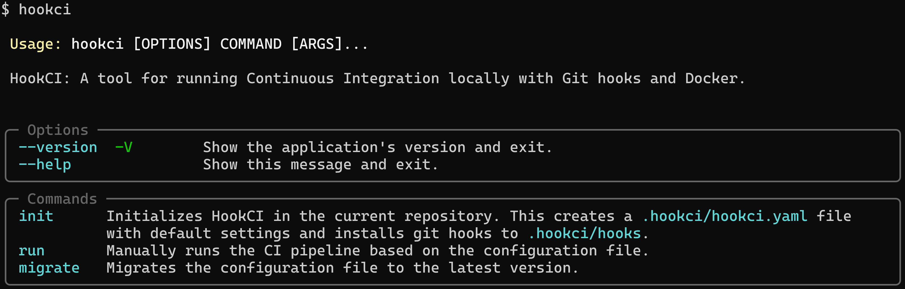

# HookCI



**HookCI** é uma ferramenta para executar tarefas de Integração Contínua (CI) localmente. Ele se integra ao Docker e aos Git hooks para validar commits e pushes, garantindo que o código atenda aos padrões de qualidade antes de ser compartilhado com a equipe.

O objetivo principal é fornecer feedback rápido aos desenvolvedores, executando testes em um ambiente Docker isolado, prevenindo problemas causados por configurações da máquina local. Ele atua como uma camada preventiva, garantindo que apenas o código que passa nos testes definidos seja integrado ao repositório central.

A configuração é gerenciada por meio de um simples arquivo YAML, e a ferramenta é operada por meio de uma Interface de Linha de Comando (CLI) dedicada.

## Alunos integrantes da equipe

* Gabriel Dolabela Marques
* Henrique Carvalho Almeida

## Professores responsáveis

* Cleiton Silva Tavares
* Joana Gabriela Ribeiro de Souza

## Instruções de utilização

HookCI pode ser instalado de várias maneiras, dependendo das suas necessidades.

### Extensão do VSCode

Esta é a maneira mais simples de instalar e usar HookCI, especialmente se você já usa o Visual Studio Code como seu editor de código.

1. Abra o Visual Studio Code.
2. Navegue até a aba de Extensões.
3. Procure por "HookCI" na barra de pesquisa.
4. Clique em "Instalar" na extensão HookCI.
5. Após a instalação, HookCI estará disponível no sistema e a extensão configurará automaticamente os hooks necessários.

Caso encontre o erro abaixo ao tentar executar o comando `hookci`, certifique-se de que o diretório `~/.local/bin` está incluído na variável de ambiente `PATH`.

```bash
bash: hookci: command not found
```

Para adicionar `~/.local/bin` ao seu `PATH`, você pode executar o seguinte comando no terminal:

```bash
echo 'export PATH="/home/${USER}/.local/bin:${PATH}"' >>~/.bashrc
source ~/.bashrc
```

### Executável (PyInstaller)

Se você prefere usar HookCI diretamente do terminal, você pode baixar o executável gerado pelo PyInstaller.

1. Baixe o executável `hookci` a partir da última [Release do GitHub](https://github.com/h3nc4/HookCI/releases/latest) e torne-o executável:

    ```bash
    wget -qO ~/.local/bin/hookci https://github.com/h3nc4/HookCI/releases/latest/download/hookci
    chmod +x ~/.local/bin/hookci
    ```

2. Execute o comando de inicialização em seu repositório Git para configurar os hooks:

    ```bash
    hookci init
    ```

### Pacote Debian (`.deb`)

Se você estiver usando uma distribuição Linux baseada em Debian você pode usar o pacote `.deb`.

1. Baixe o arquivo `.deb` a partir da última [Release do GitHub](https://github.com/h3nc4/HookCI/releases/latest).
2. Instale o pacote usando `apt`. Isso também cuidará de quaisquer dependências do sistema necessárias.

    ```bash
    sudo apt install ./hookci.deb
    ```

3. Execute o comando de inicialização em seu repositório Git para configurar os hooks:

    ```bash
    hookci init
    ```

## Comandos

```bash
hookci [OPÇÕES] COMANDO [ARGS]...
```

Os seguintes comandos estão disponíveis:

* **init**
    Inicializa o HookCI no repositório Git atual. Este comando executa duas ações principais:
  * Cria um arquivo de configuração padrão em `.hookci/hookci.yaml`.
  * Instala e configura os Git hooks necessários em um diretório local `.hookci/hooks` e define a configuração do Git `core.hooksPath` para apontar para ele. Isso evita interferir nos hooks existentes.

* **migrate**
    Migra um arquivo de configuração HookCI existente para a versão mais recente. Isso é útil ao atualizar a ferramenta HookCI para uma nova versão que introduz alterações no esquema de configuração.

* **run**
    Executa manualmente o pipeline de CI conforme definido no arquivo de configuração. Isso é útil para testar o pipeline sem acionar um evento Git.
  * **Opções**
    * `--debug`: Se uma etapa falhar, esta opção mantém o contêiner Docker em execução e anexa um shell interativo, permitindo a depuração ao vivo do ambiente no momento da falha. Esta opção é ignorada quando executada por meio de um Git hook.

* **--help**
    Exibe uma mensagem de ajuda com uma lista de comandos disponíveis e suas descrições.

## Configuração

O HookCI é configurado usando um arquivo YAML localizado em `.hookci/hookci.yaml` na raiz do seu repositório Git. As chaves principais são descritas abaixo:

* **version (string)**
    A versão do esquema de configuração do HookCI. Usado para gerenciar migrações.

* **log_level (string)**
    Define a verbosidade dos logs. Os valores possíveis são `DEBUG`, `INFO` e `ERROR`. O padrão é `INFO`.

* **docker (object)**
    Contém a configuração para o ambiente Docker onde os testes serão executados. Você deve especificar `image` ou `dockerfile`, mas não ambos.
  * **image (string)**: O nome e a tag de uma imagem Docker pré-existente para usar na execução das etapas (por exemplo, `python:3.13-slim`).
  * **dockerfile (string)**: O caminho relativo para um Dockerfile dentro do repositório. O HookCI construirá uma imagem a partir deste Dockerfile antes de executar as etapas.

* **hooks (object)**
    Define em quais Git hooks o HookCI deve ser acionado automaticamente.
  * **pre-commit (boolean)**: Se `true`, o pipeline de CI é executado automaticamente em `git commit`. O padrão é `true`.
  * **pre-push (boolean)**: Se `true`, o pipeline de CI é executado automaticamente em `git push`. O padrão é `true`.

* **filters (object)**
    Permite a execução condicional do pipeline com base no contexto do Git quando acionado por um hook.
  * **branches (string)**: Uma expressão regular para corresponder ao nome do branch atual. O pipeline só será executado se o branch atual corresponder ao padrão (por exemplo, `"feature/.*"`).
  * **commits (string)**: Uma expressão regular para corresponder à mensagem do commit. O pipeline só será executado se a mensagem corresponder. (Observação: este é um placeholder para implementação futura).

* **steps (list of objects)**
    Uma sequência de etapas a serem executadas no pipeline de CI. Cada etapa é um objeto com as seguintes chaves:
  * **name (string, required)**: Um nome descritivo para a etapa, usado nos logs.
  * **command (string, required)**: O comando de shell a ser executado dentro do contêiner Docker.
  * **critical (boolean)**: Se `true` (o padrão), uma falha nesta etapa interromperá todo o pipeline e fará com que a operação Git (commit/push) seja abortada. Se `false`, uma falha gerará apenas um aviso, e o pipeline continuará para a próxima etapa.
  * **env (object)**: Um mapa de pares chave-valor representando variáveis de ambiente a serem injetadas no contêiner para esta etapa específica.

## Exemplos

### Inicialize o HookCI em um novo projeto

```bash
hookci init
```

### Execute o pipeline de CI definido manualmente

```bash
hookci run
```

### Depure uma etapa com falha interativamente

```bash
hookci run --debug
```

### Exemplo de configuração `hookci.yaml`

```yaml
version: '1.0'
log_level: INFO
docker:
  image: python:3.13-slim
hooks:
  pre-commit: true
  pre-push: true
filters:
  branches: "main|develop|feature/.*"
steps:
  - name: "Install Dependencies"
    command: "pip install -r requirements.txt"
  - name: "Run Linters"
    command: "flake8 ."
  - name: "Run Tests"
    command: "pytest"
  - name: "Check Coverage"
    command: "coverage report --fail-under=80"
    critical: false
    env:
      CI: "true"
```
